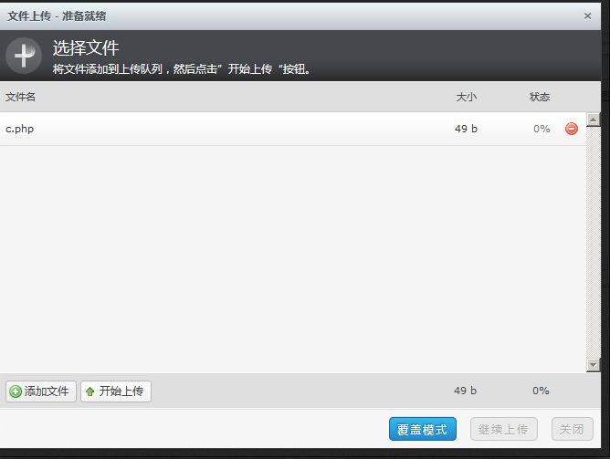
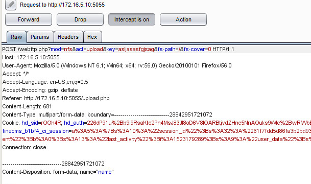
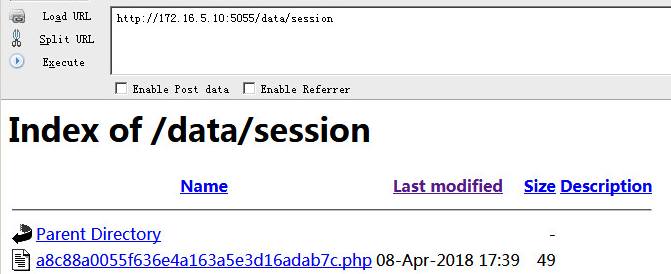
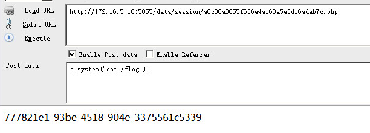

# 赛题设计说明

## 题目信息：

* 题目名称：sql_test
* 预估难度：简单 （简单/中等偏易/中等偏难/困难）


## 题目描述：
```
这是一个很简单的 web 哦，相信你一定能通过自己的聪明才智获得服务器中的 flag。
```

## 题目考点：
```
1. sql注入绕过登录
2. 文件上传
```

## 思路简述：
sql注入绕过登录，上传文件修改木马的上传路径。


## 题目提示：
1. sql注入绕过登录
2. 上传木马
3. 修改木马的上传路径


## 原始 flag 及更新命令：

```shell
    # 原始 flag
    flag{flag_test}
    # ..
    # 更新 flag 命令
    echo 'flag{85c2a01a-55f7-442a-8712-3f6908e1463a}' > /flag
```


## 题目环境：
```
1. ubuntu 14.04 LTS（更新到最新）
2. Apache/2.4.7 (Ubuntu)
3. PHP 5.5.9-1ubuntu4.25
```

## 题目制作过程：
1. 设计好漏洞，编写php相关代码
2. 按照“Docker示例文档.md”来编写Dockerfile，制作好镜像。

## 题目writeup：

在登录界面
用户名 123" union select "21232f297a57a5a743894a0e4a801fc3"#
密码  admin

点击“上传”，“添加文件”，选择一句话木马文件

使用burpsuite抓包，点击“开始上传”

修改上传路径fs-path=/
为fs-path=../session/
而/data/session/存在列目录漏洞，访问

找到32md5值+你上传的文件的文件名 即可（可以点击Last modified）


## 注意事项

1. 题目名称不要有特殊符号，可用下划线代替空格；
2. 根据设计的赛题，自行完善所有文件夹中的信息；
3. 此文件夹下信息未完善的队伍，将扣除一定得分。